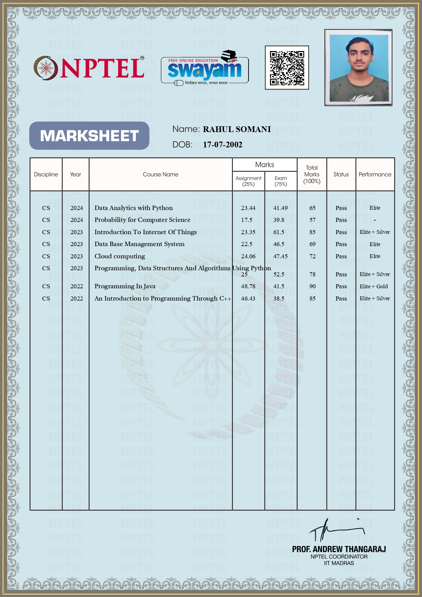
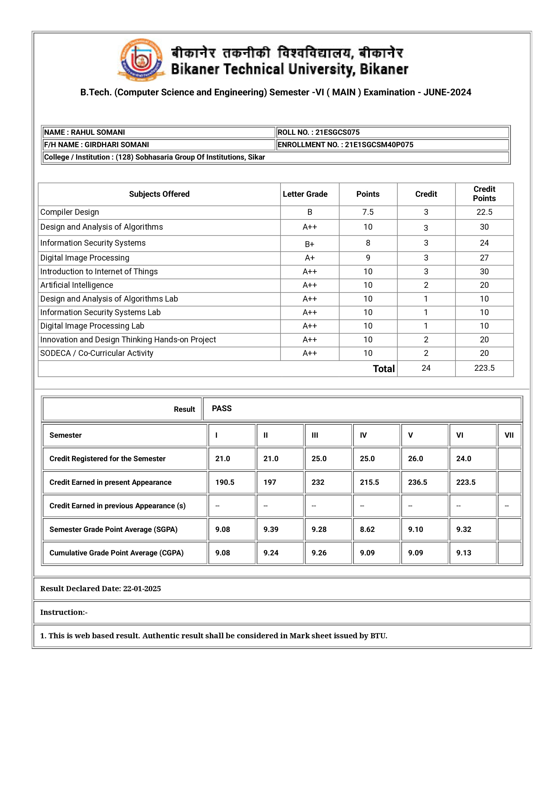

# Contents  
_(Click a section to jump)_
## [Domain Certificate](#completed-eight-courses-constructed-by-iits-) 
## [Academic Result](#latest-academic-result)
## [Other Certificates Information Alltogether](#all-other-courses)

# My astonishing performances
### Completed eight courses constructed by IITs :   [Go back to top ⬆](#contents)

### Latest Academic Result:                         [Go back to top ⬆](#contents)

### All other courses:                              [Go back to top ⬆](#contents)
| Name                                       | Score | Date of certification | Institution      |
| :----------------------------------------- | :---: | :-------------------: | :--------------: |
| 1. Data Analytics with Python                 | 65    | April, 2024           | IIT Roorkee      |
| 2. Probability for Computer Science           | 57    | April, 2024           | IIT Kanpur       |
| 3. Database Management System                 | 69    | September, 2023       | IIT Kharagpur    |
| 4. Cloud Computing                            | 72    | April, 2023           | IIT Kharagpur    |
| 5. Introduction to IOT                        | 85    | October, 2023         | IIT Kharagpur    |
| 6. Programming and DSA using Python           | 78    | March, 2023           | IIT Madras       |
| 7. An Introduction to Programming through CPP | 85    | April,2022            | IIT Bombay       |
| 8. Programming in Java                        | 90    | October,2022          | IIT Kharagpur    |
