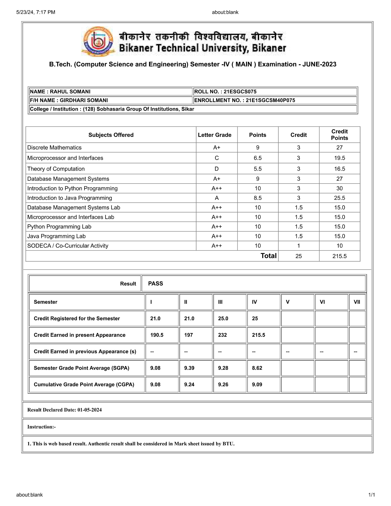

# Contents of Readme:
## Domain Certificate
## Academic Result
## Other Certificates Information Alltogether

# My astonishing performances
### Completed six courses by IITs finishing Programming Domain:

### Latest Academic Result: 

### All other courses: 
| Name                                       | Score | Date of certification | Institution      |
| :----------------------------------------: | :---: | :-------------------: | :--------------: |
| Database Management System                 | 69    | September, 2023       | IIT Kharagpur    |
| Cloud Computing                            | 72    | April, 2023           | IIT Kharagpur    |
| Introduction to IOT                        | 85    | October, 2023         | IIT Kharagpur    |
| Programming and DSA using Python           | 78    | March, 2023           | IIT Madras       |
| An Introduction to Programming through CPP | 85    | April,2022            | IIT Bombay       |
| Programming in Java                        | 90    | October,2022          | IIT Kharagpur    |